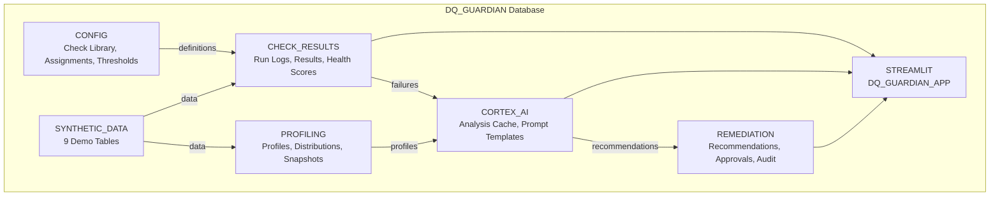
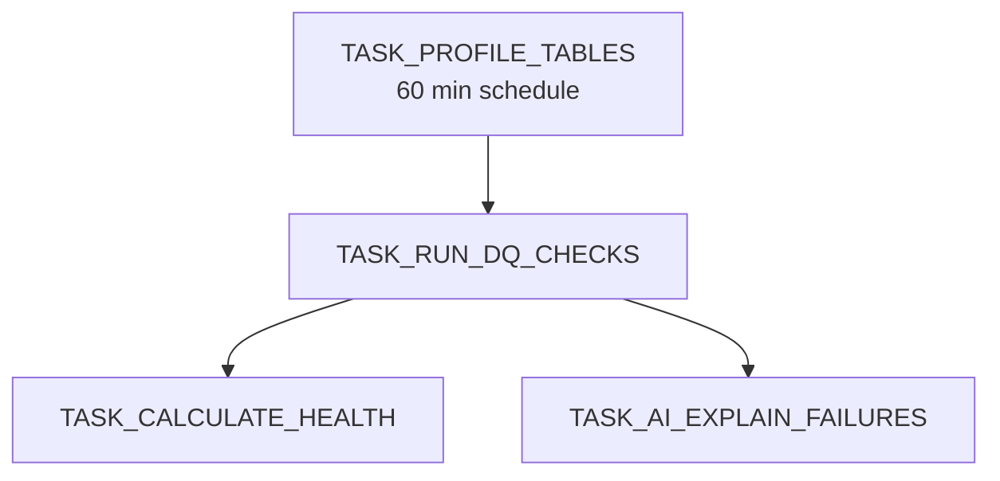
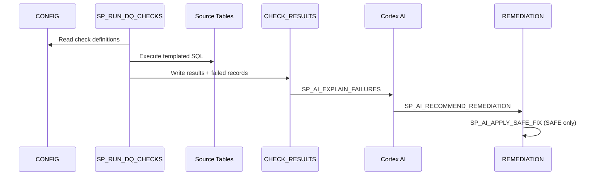

# Architecture

## System Overview

DQ Guardian is a single-database Snowflake-native application. All compute, storage, orchestration, and AI inference run inside Snowflake.

## Task DAG

All tasks created SUSPENDED.

## Data Flow

## Metadata-Driven Engine

The core design: **no IF/ELSE branching**. Each of 25 check types stores a SQL template in `DQ_CHECK_LIBRARY`. At runtime, `SP_RUN_DQ_CHECKS` substitutes `{{placeholders}}` from `DQ_CHECK_ASSIGNMENTS.PARAMS_JSON` using a custom `safeReplace()` function (avoids JavaScript `$` regex issues), then executes the SQL dynamically.

## Stream Architecture

| Stream | Source | Purpose |
|---|---|---|
| `STREAM_DQ_CHECK_RESULTS` | `DQ_CHECK_RESULTS` | New check results |
| `STREAM_SCHEMA_SNAPSHOTS` | `SCHEMA_SNAPSHOTS` | Schema drift triggers |
| `STREAM_AI_RECOMMENDATIONS` | `AI_RECOMMENDATIONS` | New AI recommendations |
| `STREAM_REMEDIATION_AUDIT` | `REMEDIATION_AUDIT` | Remediation audit trail |
